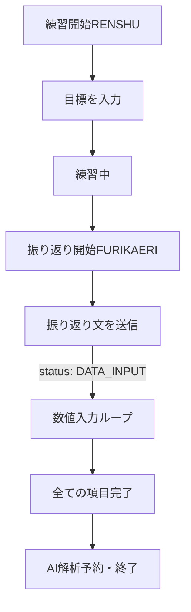

# LINE 運用フローガイド

*   作成日: 2026-02-14
*   対応バージョン: v1.6.0〜

Naiguru Insights における、LINE上での対話フローの詳細です。

## 1. 全体フロー図

## 2. 各ステップの詳細

### ① 練習開始
*   **ユーザー**: `練習開始RENSHU` を送信
*   **システム**: 前回の振り返り要約を表示し、「今日の目標を入力してください」と促します。
*   **エラー**: 既に練習が開始されている場合は「既に練習は開始されています」と返します。

### ② 目標設定
*   **ユーザー**: 練習の目標（自由記述）を送信
*   **システム**: 目標を保存し、「目標『〇〇』を受け付けました。練習が終わったら『振り返り開始FURIKAERI』と送ってください」と返します。

### ③ 振り返り（自由記述）
*   **ユーザー**: `振り返り開始FURIKAERI` を送信
*   **システム**: 「練習お疲れ様でした！今日の振り返りを入力してください。」と返します。
*   **ユーザー**: 今日の感想や反省を送信
*   **システム**: 文章を保存し、そのまま**数値入力フェーズ**へ自動的に移行します。

### ④ 数値入力（対話型ループ）
`config.gs` で定義された項目が、一つずつ順番に質問されます。

*   **システム**: 「BULL数を入力してください。（スキップする場合は『-』を入力）」
*   **ユーザー**: 数値を送信（例：`11`）
    *   **正常**: 値を保存し、次の項目（LowTon数など）があれば続けて質問します。
    *   **スキップ**: `-` (ハイフン) を送信すると、その項目を空欄のまま次へ進みます。
    *   **エラー**: 数値でも `-` でもない文字（例：「なし」など）を送った場合、以下のメッセージを返し、同じ項目の再入力を求めます。
        *   > 数値を入力してください。スキップする場合は「-」を入力してください。

## 3. 完了とAI解析
全ての数値項目（定義されているもの全て）の入力が終わると、以下のメッセージが届きます。

*   **システム**: 「練習お疲れ様でした！全ての記録を完了しました。」

このメッセージが届いた約1分後に、GeminiによるAI解析（練習の要約）が自動的に実行され、次回の練習開始時に表示されるようになります。

## 4. 中断と再開
*   数値入力の途中で入力をやめてしまった場合でも、セッションは維持されます。
*   次に何かメッセージを送った際、システムは「まだ埋まっていない数値項目」があることを検知し、再び数値の入力を求めます。
*   数値入力を完了させない限り、新しく `練習開始RENSHU` を行うことはできません。
